# 🏗️ Boilerplate Blueprint - Architecture Diagrams

This document contains Mermaid.js diagrams illustrating the system architecture, data flow, and component interactions.

## 📊 System Architecture Overview

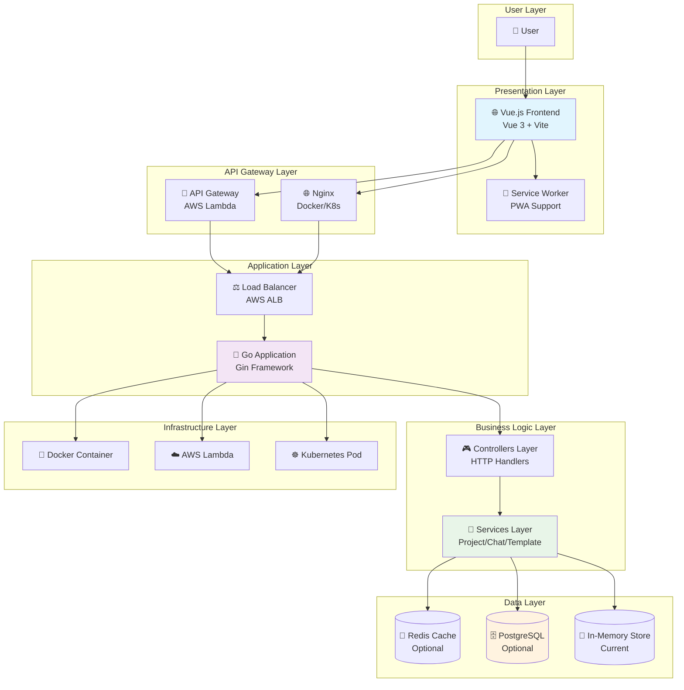

## 🔄 Request Flow Control

### HTTP Request Journey

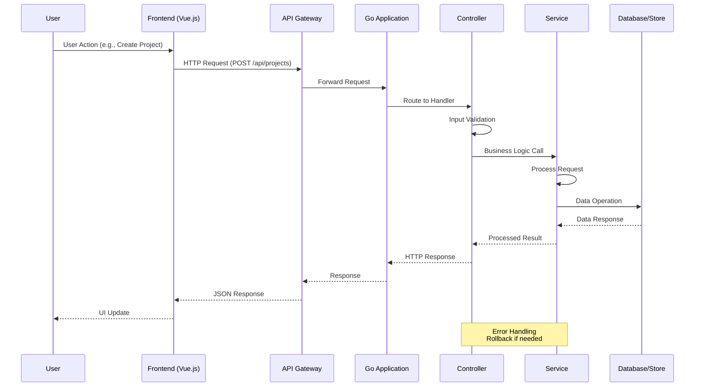

### AWS Lambda Request Flow

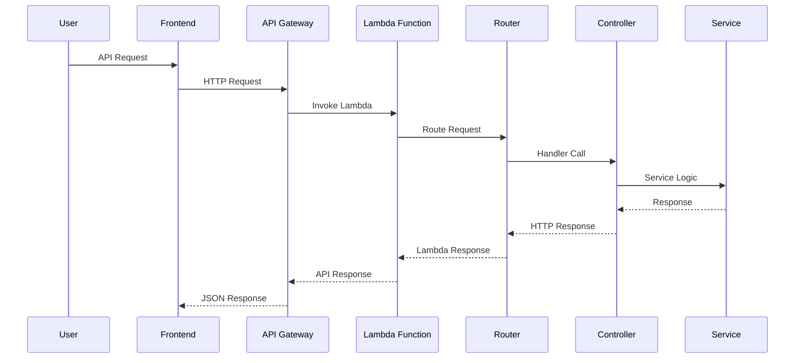

## 🗂️ Data Lineage: Project Creation Flow

### Variable Tracing: `projectName` Parameter

```mermaid
flowchart TD
    subgraph "Input Layer"
        A[📝 User Input<br/>projectName: "my-app"]
        B[🌐 Frontend Form<br/>this.projectName]
    end

    subgraph "Network Layer"
        C[📡 HTTP Request<br/>POST /api/projects<br/>Body: {name: "my-app"}]
        D[🚪 API Gateway<br/>event.body.projectName]
    end

    subgraph "Application Layer"
        E[🎮 Controller<br/>req.Body → JSON Parse<br/>projectRequest.Name]
        F[🔧 Service<br/>ProjectService.CreateProject<br/>req.Name]
    end

    subgraph "Business Logic"
        G[📋 Validation<br/>validateProjectName(name)<br/>✓ Length, Format, Uniqueness]
        H[🏗️ Project Struct<br/>project := &Project{<br/>Name: name,<br/>...}]
    end

    subgraph "Data Layer"
        I[💾 In-Memory Store<br/>projects[projectID] = project]
        J[🗄️ Database (Future)<br/>INSERT INTO projects<br/>VALUES (name, ...)]
    end

    subgraph "Response Layer"
        K[📤 Service Response<br/>return project, nil]
        L[🎮 Controller Response<br/>c.JSON(200, project)]
        M[🌐 Frontend Update<br/>this.currentProject = response.data]
    end

    A --> B
    B --> C
    C --> D
    D --> E
    E --> F
    F --> G
    G --> H
    H --> I
    I --> J
    I --> K
    K --> L
    L --> M

    style A fill:#e3f2fd
    style B fill:#e3f2fd
    style G fill:#fff9c4
    style H fill:#fff9c4
    style I fill:#fff9c4
```

### Variable State Transitions

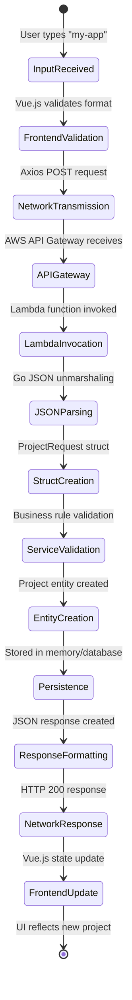

## 🏛️ Component Architecture

### Service Component Diagram

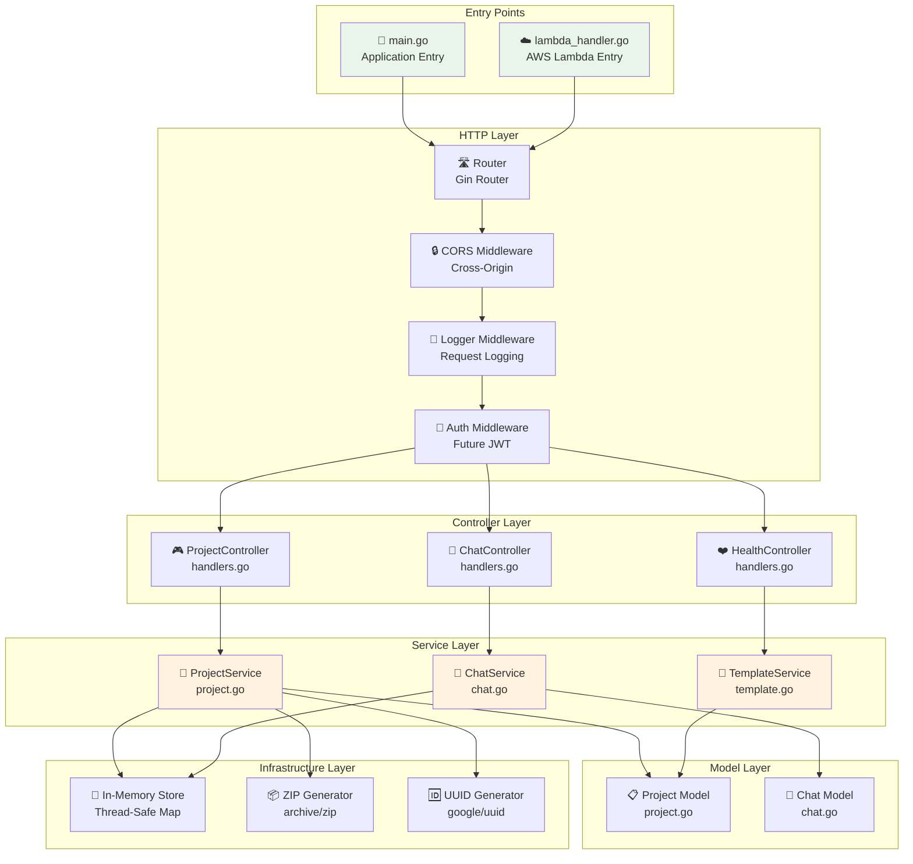

### Data Flow Architecture

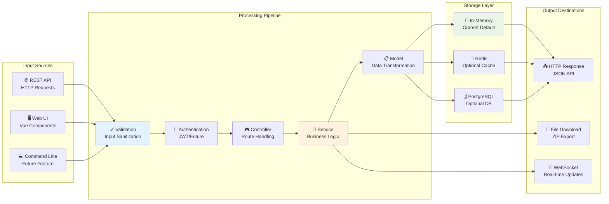

## 🔄 CI/CD Pipeline Flow

### GitHub Actions Workflow

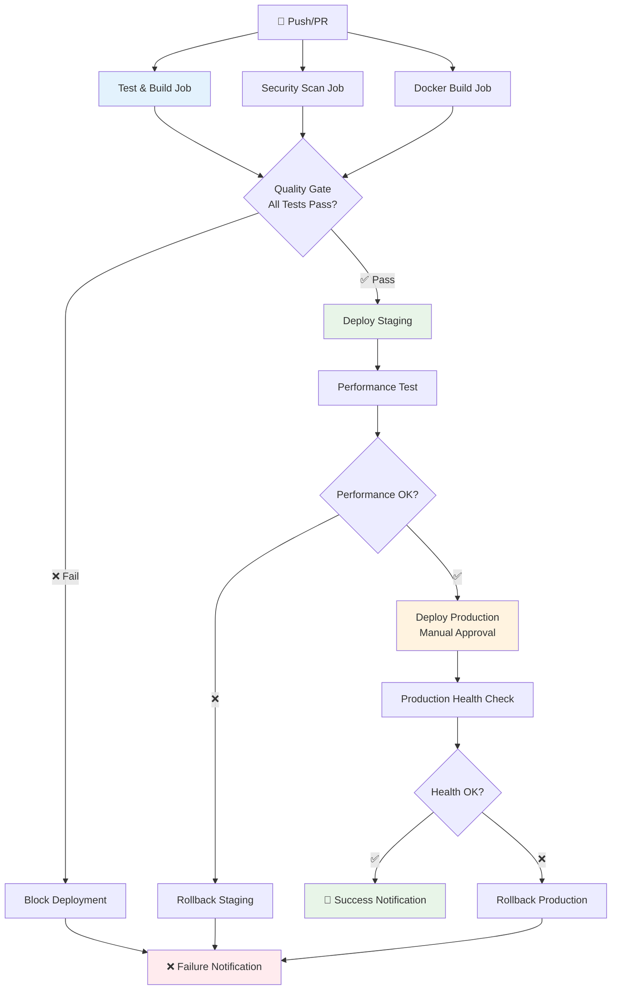

## 🌐 Deployment Architecture

### Multi-Environment Deployment

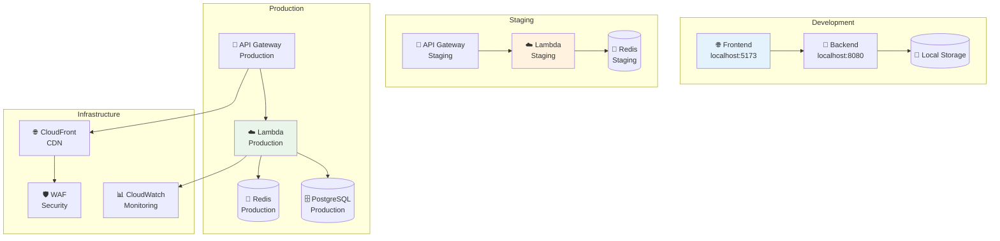

## 🔐 Security Architecture

### Request Security Flow

```mermaid
flowchart LR
    subgraph "External"
        USER[👤 User Request]
        ATTACK[🚫 Malicious Request]
    end

    subgraph "Edge Security"
        WAF[🛡️ Web Application Firewall<br/>AWS WAF]
        RATE[⚡ Rate Limiting<br/>API Gateway]
        CORS[🔒 CORS Policy<br/>Origin Validation]
    end

    subgraph "Application Security"
        AUTH[🔐 Authentication<br/>JWT Validation]
        AUTHZ[👮 Authorization<br/>Role-based Access]
        VALID[✅ Input Validation<br/>Sanitization]
    end

    subgraph "Data Security"
        ENCRYPT[🔐 Data Encryption<br/>TLS in Transit]
        AUDIT[📝 Audit Logging<br/>CloudWatch]
        BACKUP[💾 Backup Security<br/>Encrypted Storage]
    end

    USER --> WAF
    ATTACK --> WAF
    WAF --> RATE
    RATE --> CORS
    CORS --> AUTH
    AUTH --> AUTHZ
    AUTHZ --> VALID
    VALID --> ENCRYPT
    ENCRYPT --> AUDIT
    AUDIT --> BACKUP

    style USER fill:#e8f5e8
    style ATTACK fill:#ffebee
    style WAF fill:#fff3e0
    style VALID fill:#e3f2fd
```

## 📈 Performance Monitoring

### Application Metrics Flow

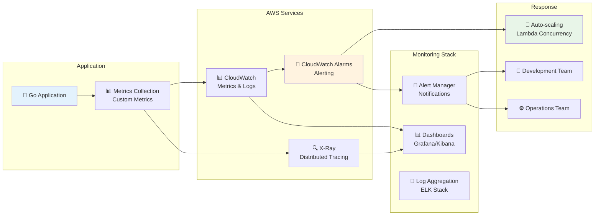

## 🎯 Data Lineage Example: Chat Message Processing

### Message Processing Pipeline

```mermaid
flowchart TD
    A[💬 User Input<br/>message: "Create Go API"] --> B[🌐 Frontend<br/>chatStore.sendMessage()]
    B --> C[📡 HTTP POST<br/>/api/chat/message]
    C --> D[🚪 API Gateway<br/>Lambda Trigger]

    D --> E[☁️ Lambda Handler<br/>lambda_handler.go]
    E --> F[🛣️ Router<br/>gin.Router]
    F --> G[🎮 ChatController<br/>ProcessMessage()]

    G --> H[🔧 ChatService<br/>ProcessMessage()]
    H --> I[🤖 AI Processing<br/>generateRuleBasedResponse()]
    I --> J[📝 Message Creation<br/>ChatMessage struct]

    J --> K[💾 Storage<br/>conversations map]
    K --> L[📋 Response Formatting<br/>ChatResponse struct]
    L --> M[🎮 Controller Response<br/>c.JSON(200, response)]

    M --> N[☁️ Lambda Response<br/>events.APIGatewayV2HTTPResponse]
    N --> O[🚪 API Gateway Response]
    O --> P[🌐 Frontend Update<br/>messages.push(response)]

    style A fill:#e3f2fd
    style I fill:#fff3e0
    style J fill:#fff9c4
    style K fill:#fff9c4
    style P fill:#e8f5e8
```

## 📚 Component Interaction Details

### Service Dependencies

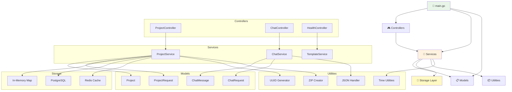

## 🔄 Error Handling Flow

### Exception Propagation

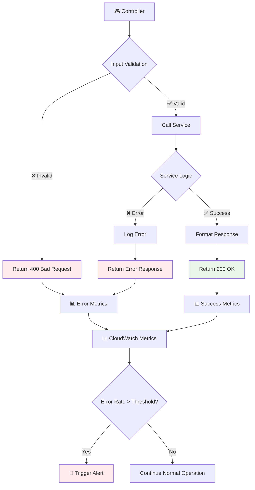

---

## 📖 Diagram Legend

| Symbol | Meaning |
|--------|---------|
| 👤 | User/Client |
| 🌐 | Frontend/Web |
| 🚪 | API Gateway |
| 🐹 | Go Application |
| 🎮 | Controller Layer |
| 🔧 | Service Layer |
| 📋 | Model/Data Layer |
| 💾 | Storage/Database |
| ☁️ | Cloud/AWS Lambda |
| 🐳 | Docker Container |
| ☸️ | Kubernetes |
| ⚖️ | Load Balancer |
| 🔒 | Security/Middleware |
| 📊 | Monitoring/Metrics |
| ✅ | Success/Validation |
| ❌ | Error/Failure |

## 🎯 Reading Guide for New Developers

### 1. **System Architecture Overview**
   - Start here to understand the high-level system components
   - Follow the data flow from user to database
   - Understand deployment options (Lambda vs Docker vs K8s)

### 2. **Request Flow Control**
   - Trace how HTTP requests journey through the system
   - Understand middleware layers and error handling
   - See how AWS Lambda differs from traditional server deployment

### 3. **Data Lineage Diagrams**
   - Follow specific data variables through the entire pipeline
   - Understand state transformations and validation steps
   - See how business logic processes user inputs

### 4. **Component Architecture**
   - Understand service dependencies and interactions
   - See how layers communicate with each other
   - Identify where to add new features or modify existing ones

### 5. **CI/CD Pipeline**
   - Understand automated testing and deployment
   - See quality gates and approval processes
   - Follow how changes move from development to production

### 6. **Error Handling Flow**
   - Understand how errors propagate through the system
   - See monitoring and alerting mechanisms
   - Learn debugging and troubleshooting approaches

This documentation provides a comprehensive visual guide to the Boilerplate Blueprint system architecture, making it easier for new developers to understand the codebase structure, data flow, and deployment processes.