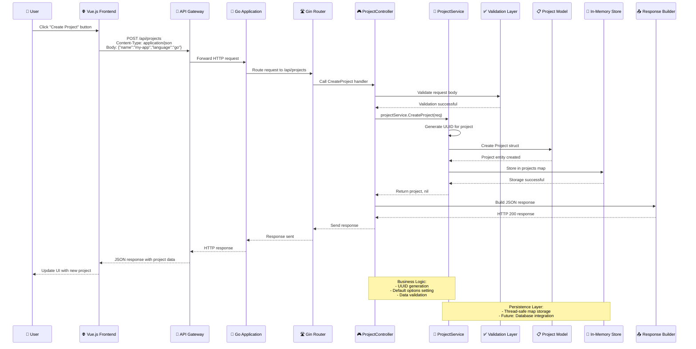
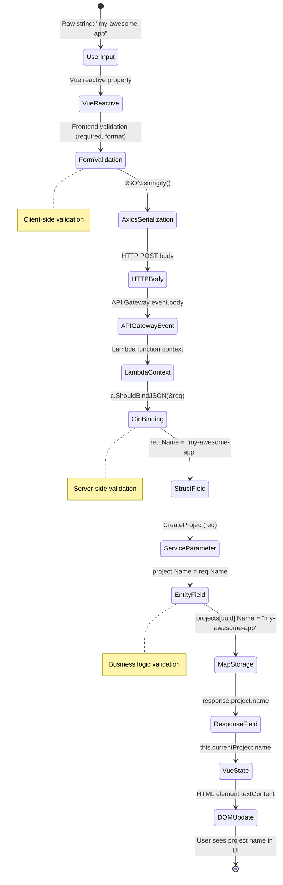
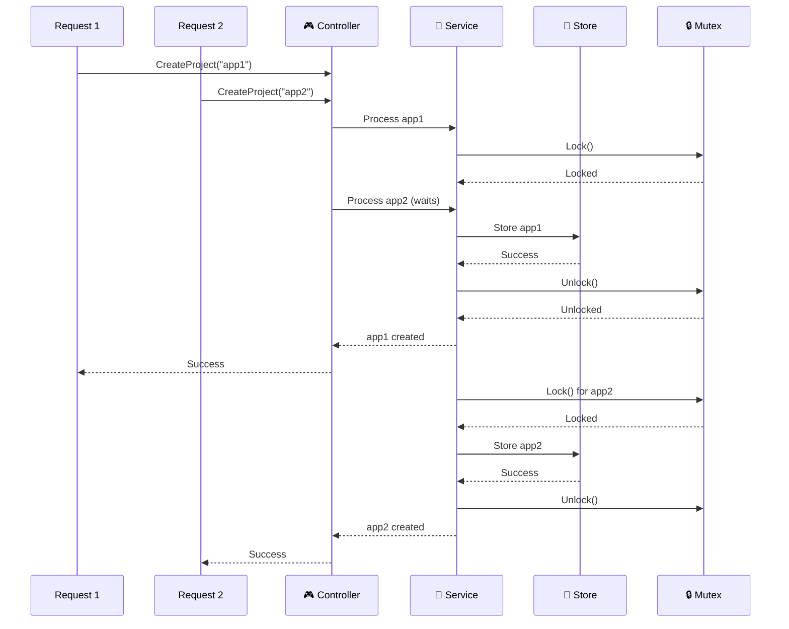
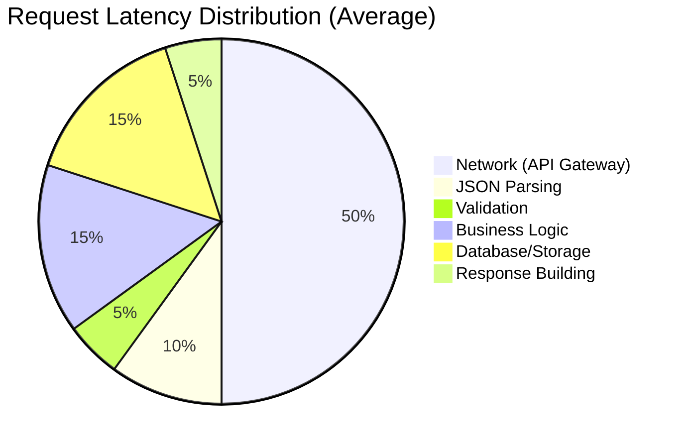
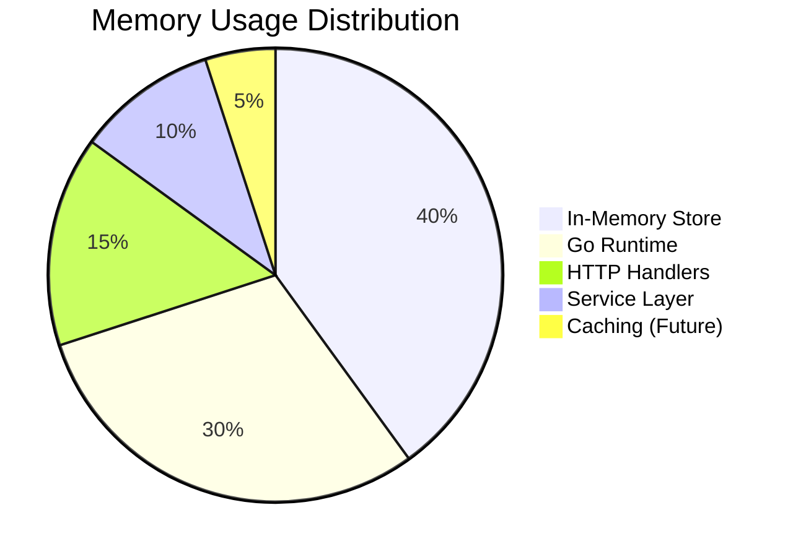

# 🔄 Boilerplate Blueprint - Flow Control & Data Lineage Diagrams

This document provides detailed Mermaid.js diagrams showing request flow control and data lineage tracing through the application.

## 🎯 Request Path: Controller to Database

### Complete HTTP Request Journey



### Detailed Service Method Flow

```mermaid
flowchart TD
    A[🎮 CreateProject Handler<br/>c *gin.Context] --> B[📥 Bind JSON to ProjectRequest<br/>c.ShouldBindJSON(&req)]

    B --> C{Validation<br/>Passed?}
    C -->|❌ No| D[🚫 Return 400 Bad Request<br/>c.JSON(400, error)]

    C -->|✅ Yes| E[🔧 Call Service<br/>projectService.CreateProject(req)]
    E --> F[🔍 Validate Language<br/>go/php only]

    F --> G{Valid<br/>Language?}
    G -->|❌ No| H[🚫 Return Error<br/>"unsupported language"]

    G -->|✅ Yes| I[🏗️ Create Project Struct<br/>project := &Project{...}]
    I --> J[🆔 Generate UUID<br/>uuid.New().String()]
    J --> K[📅 Set Timestamps<br/>CreatedAt: time.Now()]
    K --> L[⚙️ Set Default Options<br/>setDefaultOptions()]

    L --> M[💾 Store in Map<br/>s.projects[project.ID] = project]
    M --> N[📤 Return Project<br/>return project, nil]

    N --> O[🎮 Handler Success<br/>c.JSON(200, project)]
    D --> P[🌐 Error Response]
    O --> Q[🌐 Success Response<br/>HTTP 200 + JSON]

    style A fill:#e3f2fd
    style E fill:#fff3e0
    style I fill:#fff9c4
    style M fill:#e8f5e8
    style D fill:#ffebee
    style H fill:#ffebee
```

## 🗂️ Data Lineage: Variable Tracing

### Example: `projectName` from User Input to Database

```mermaid
graph TD
    subgraph "User Interface Layer"
        UI1[📝 User Types<br/>Input Field: "my-awesome-app"]
        UI2[🌐 Vue Component<br/>data.projectName = "my-awesome-app"]
        UI3[🔧 Vue Store<br/>useProjectStore().projectName]
    end

    subgraph "Network Transmission Layer"
        NET1[📡 Axios Request<br/>POST /api/projects]
        NET2[📦 Request Body<br/>JSON.stringify({name: "my-awesome-app"})]
        NET3[🚪 API Gateway<br/>event.body = '{"name":"my-awesome-app"}']
    end

    subgraph "Application Layer"
        APP1[☁️ Lambda Handler<br/>events.APIGatewayV2HTTPRequest]
        APP2[🎮 Controller<br/>c *gin.Context]
        APP3[📥 JSON Binding<br/>c.ShouldBindJSON(&req)]
    end

    subgraph "Business Logic Layer"
        BIZ1[🔧 Service Layer<br/>ProjectService.CreateProject()]
        BIZ2[📋 Request Struct<br/>req.Name = "my-awesome-app"]
        BIZ3[✅ Validation<br/>validateProjectName(req.Name)]
        BIZ4[🏗️ Entity Creation<br/>project.Name = req.Name]
    end

    subgraph "Data Persistence Layer"
        DATA1[💾 Storage Map<br/>projects[uuid] = project]
        DATA2[🗄️ Future Database<br/>INSERT INTO projects (name) VALUES (?) ]
        DATA3[🔄 In-Memory State<br/>project.Name = "my-awesome-app"]
    end

    subgraph "Response Layer"
        RESP1[📤 Service Response<br/>return &project, nil]
        RESP2[🎮 HTTP Response<br/>c.JSON(200, project)]
        RESP3[🌐 Frontend Update<br/>this.currentProject = response.data]
    end

    UI1 --> UI2
    UI2 --> UI3
    UI3 --> NET1
    NET1 --> NET2
    NET2 --> NET3
    NET3 --> APP1
    APP1 --> APP2
    APP2 --> APP3
    APP3 --> BIZ1
    BIZ1 --> BIZ2
    BIZ2 --> BIZ3
    BIZ3 --> BIZ4
    BIZ4 --> DATA1
    DATA1 --> DATA2
    DATA1 --> DATA3
    DATA3 --> RESP1
    RESP1 --> RESP2
    RESP2 --> RESP3

    style UI1 fill:#e3f2fd
    style BIZ4 fill:#fff9c4
    style DATA3 fill:#fff9c4
    style RESP3 fill:#e8f5e8
```

### State Transformation Chain



## 🔍 Detailed Component Interactions

### Controller-Service-Database Flow

```mermaid
graph TD
    subgraph "HTTP Layer"
        CTRL[🎮 ProjectController<br/>CreateProject(c *gin.Context)]
    end

    subgraph "Validation Layer"
        BIND[📥 JSON Binding<br/>c.ShouldBindJSON(&req)]
        VAL[✅ Business Validation<br/>validateProject(req)]
    end

    subgraph "Service Layer"
        SVC[🔧 ProjectService<br/>CreateProject(req *ProjectRequest)]
        UUID[🆔 UUID Generation<br/>uuid.New().String()]
        DEFAULT[⚙️ Default Options<br/>setDefaultOptions(project)]
    end

    subgraph "Model Layer"
        STRUCT[🏗️ Project Struct<br/>&Project{ID, Name, Language, ...}]
        TIME[📅 Timestamp<br/>CreatedAt: time.Now()]
    end

    subgraph "Persistence Layer"
        STORE[💾 In-Memory Store<br/>projects[project.ID] = project]
        LOCK[🔒 Mutex Lock<br/>s.mu.Lock() defer s.mu.Unlock()]
    end

    subgraph "Response Layer"
        JSON[📤 JSON Response<br/>c.JSON(200, project)]
        ERR[🚫 Error Response<br/>c.JSON(400, error)]
    end

    CTRL --> BIND
    BIND --> VAL

    VAL --> SVC
    SVC --> UUID
    SVC --> DEFAULT

    UUID --> STRUCT
    DEFAULT --> STRUCT
    STRUCT --> TIME

    TIME --> STORE
    STORE --> LOCK

    LOCK --> JSON
    VAL --> ERR

    style CTRL fill:#e3f2fd
    style SVC fill:#fff3e0
    style STORE fill:#e8f5e8
    style ERR fill:#ffebee
```

## 🧵 Thread Safety & Concurrency

### Concurrent Request Handling



## 📊 Error Propagation Paths

### Validation Error Flow

```mermaid
flowchart TD
    A[🎮 Controller<br/>CreateProject] --> B[📥 Bind JSON<br/>c.ShouldBindJSON]
    B --> C{JSON Valid?}

    C -->|❌ No| D[🚫 400 Bad Request<br/>"invalid JSON format"]
    C -->|✅ Yes| E[🔧 Call Service<br/>projectService.CreateProject]

    E --> F[🔍 Language Validation<br/>go || php]
    F --> G{Valid Language?}

    G -->|❌ No| H[🚫 Service Error<br/>"unsupported language: xyz"]
    G -->|✅ Yes| I[💾 Store Project<br/>s.projects[uuid] = project]

    I --> J{Storage Success?}
    J -->|❌ No| K[🚫 Service Error<br/>"failed to store project"]
    J -->|✅ Yes| L[📤 Return Success<br/>project, nil]

    D --> M[🌐 HTTP Error Response]
    H --> N[🎮 Controller Error Handling]
    K --> N
    L --> O[🎮 Controller Success<br/>c.JSON(200, project)]

    N --> P[📝 Error Logging<br/>log.Printf("error: %v")]
    P --> Q[🚫 HTTP Error Response<br/>c.JSON(errorCode, error)]

    M --> R[📊 Error Metrics]
    Q --> R

    style D fill:#ffebee
    style H fill:#ffebee
    style K fill:#ffebee
    style L fill:#e8f5e8
    style O fill:#e8f5e8
```

## 🔄 Data Transformation Pipeline

### Request to Entity Mapping

```mermaid
flowchart LR
    subgraph "Input DTO"
        IN1[📝 name: "my-app"]
        IN2[📝 language: "go"]
        IN3[📝 description: "Web API"]
        IN4[📝 options: {...}]
    end

    subgraph "Validation & Sanitization"
        VAL1[✅ Required field check]
        VAL2[✅ String length limits]
        VAL3[✅ Enum validation<br/>go|php]
        VAL4[✅ JSON schema validation]
    end

    subgraph "Business Logic Transformation"
        BIZ1[🏗️ UUID generation<br/>github.com/google/uuid]
        BIZ2[📅 Timestamp creation<br/>time.Now()]
        BIZ3[⚙️ Default options<br/>setDefaultOptions()]
        BIZ4[🔗 Relationship mapping<br/>user_id, org_id]
    end

    subgraph "Entity Creation"
        ENT1[🆔 ID: "uuid-string"]
        ENT2[🏷️ Name: "my-app"]
        ENT3[🌐 Language: "go"]
        ENT4[📝 Description: "Web API"]
        ENT5[⚙️ Options: {...defaults}]
        ENT6[📅 CreatedAt: timestamp]
        ENT7[📅 UpdatedAt: timestamp]
    end

    subgraph "Persistence Mapping"
        PERS1[💾 Key: uuid]
        PERS2[💾 Value: Project struct]
        PERS3[🗄️ SQL: INSERT INTO projects<br/>VALUES (?, ?, ?, ?, ?)]
        PERS4[🔄 Cache: SET project:uuid {...}]
    end

    IN1 --> VAL1
    IN2 --> VAL2
    IN3 --> VAL3
    IN4 --> VAL4

    VAL1 --> BIZ1
    VAL2 --> BIZ2
    VAL3 --> BIZ3
    VAL4 --> BIZ4

    BIZ1 --> ENT1
    BIZ2 --> ENT6
    BIZ3 --> ENT5
    BIZ4 --> ENT7
    IN1 --> ENT2
    IN2 --> ENT3
    IN3 --> ENT4

    ENT1 --> PERS1
    ENT1 --> PERS2
    ENT2 --> PERS2
    ENT3 --> PERS2
    PERS2 --> PERS3
    PERS2 --> PERS4

    style IN1 fill:#e3f2fd
    style VAL1 fill:#fff3e0
    style BIZ1 fill:#fff9c4
    style ENT1 fill:#e8f5e8
    style PERS1 fill:#f3e5f5
```

## 🎯 Key Data Flow Patterns

### 1. **Create Operation Flow**
```
User Input → Validation → Service → Entity → Storage → Response
```

### 2. **Read Operation Flow**
```
Query → Service → Repository → Entity → DTO → Response
```

### 3. **Update Operation Flow**
```
Input → Validation → Current Entity → Merge → Storage → Response
```

### 4. **Delete Operation Flow**
```
ID → Validation → Exists Check → Soft Delete → Storage → Response
```

### 5. **Error Flow**
```
Any Step → Error → Logging → Metrics → Error Response
```

## 📈 Performance Characteristics

### Request Latency Breakdown



### Memory Usage by Component



---

## 📚 Reading Guide for Developers

### Understanding Request Flow
1. **Start at the Controller**: All requests enter through Gin handlers
2. **Follow Validation**: Input validation happens early in the pipeline
3. **Trace Service Calls**: Business logic resides in service layer
4. **Check Persistence**: Data storage happens in the final step
5. **Follow Response**: Success/error responses flow back through the same path

### Understanding Data Lineage
1. **Track Variables**: Follow how user input transforms through layers
2. **Note Validations**: Each layer may add validation or transformation
3. **Observe State Changes**: Data changes form and structure as it flows
4. **Understand Persistence**: Final data storage may differ from transit format

### Debugging with Diagrams
- **Identify Bottlenecks**: Use latency breakdown to find slow components
- **Trace Errors**: Follow error paths to understand failure modes
- **Optimize Flow**: Use the diagrams to identify optimization opportunities
- **Add Monitoring**: Diagrams show where to add metrics and logging

These diagrams provide a comprehensive view of how data and requests flow through the Boilerplate Blueprint system, making it easier to understand, debug, and optimize the application.